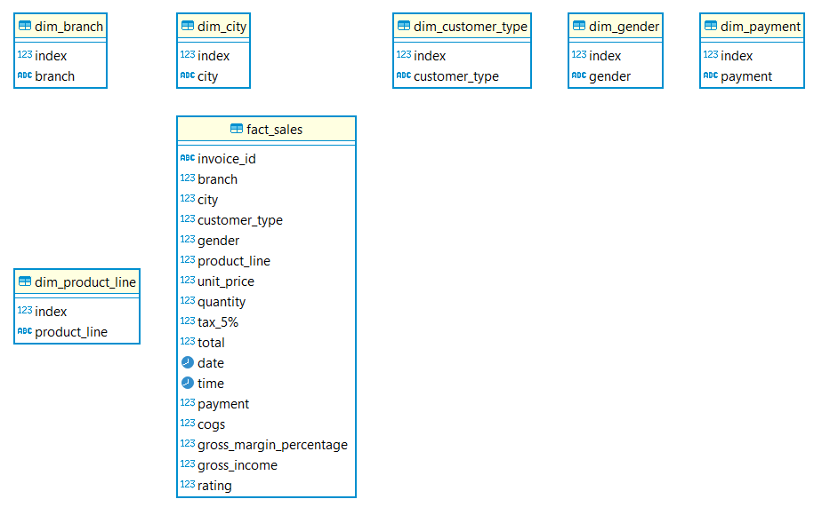
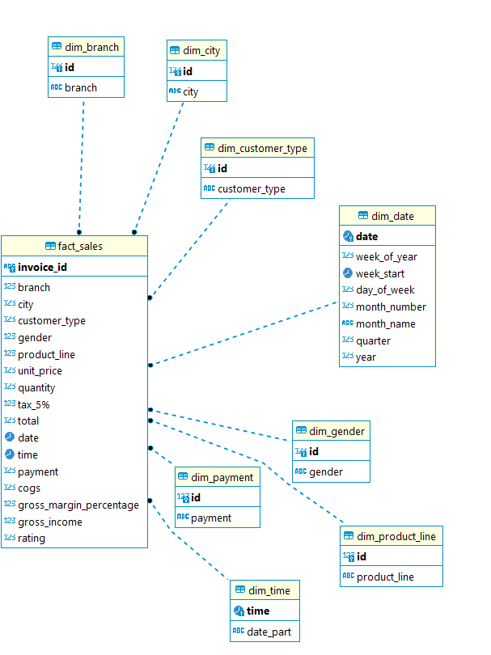
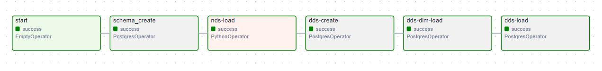
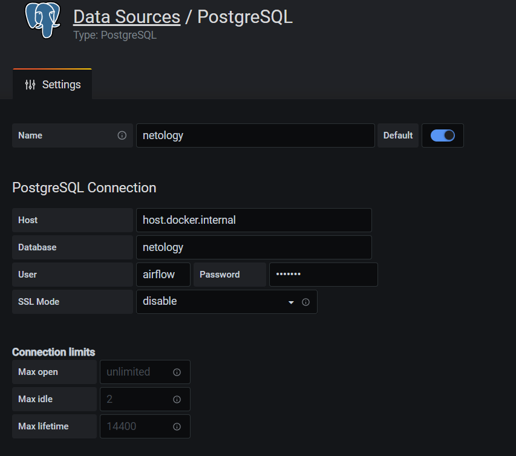
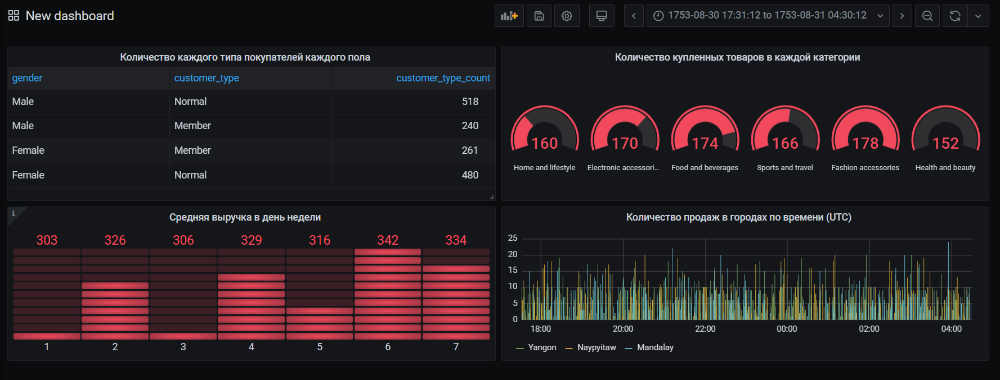

## Описание проекта
Цель проекта: составить документацию процессов ETL на основе предложенного датасета

Ход работы: 
* Анализ данных
* Формирование NDS и DDS схемы
* Формирование ETL процесса
* Формирование дашбордов

## План работы
### Формирование схем
После изучения данных было принято решение, что:

* В __nds__ будут заливаться нормализованные до 3NF таблицы фактов и измерений, но без Primary Key
* В __dds__ будут данные из таблиц фактов и измерений nds с преобразованными форматами, ключами. При этом вставляться будут только новые данные. Так же будут два справочника с датами для дашбордов.
* В __stg__ будут данные для витрин/вьюшек и т.д.

Для NDS имеем следующую диаграмму: 

Для DDS: 

### Airflow + PostgreSQL
> В качестве базы данных используется PostgreSQL. Для ETL процесса был выбран оркестратор Airflow.

Весь пайплайн реализован в одном даге со следующей задумкой: 

* start - EmptyOperator, начало работы
* schema_create - PostgresOperator, создание схем, если таковые не имеются
* nds-load - PythonOperator, берущий с другого файла функции питона, реализующие заполнение nds схемы
* dds-create - PostgresOperator, создание таблиц dds схем, если таковые не имеются
* dds-dim-load - PostgresOperator, заполнение dds dim таблиц из nds слоя
* dds-load - PostgresOperator, заполнение таблицы фактов из nds слоя
* end - EmptyOperator, конец работы

### DashBoard
Альтернативой Tableu была выбрана Grafana, из-за простоты в развертывании.
> Так же в графане можно настроить наблюдение за ресурсами airflow.

Задаем создание коннектора к базе:

Создаем несколько дашбордов на основе данных:

Создание дашбордов происходит напрямую в Grafana через написание запросов. Так же можно реализовать в stg слое view, к которой обращаться уже в UI. 

## Итог работы
* Реализованы схемы NDS и DDS
* Реализован ETL процесс с помощью Airflow
* Реализованы дашборды в Grafana